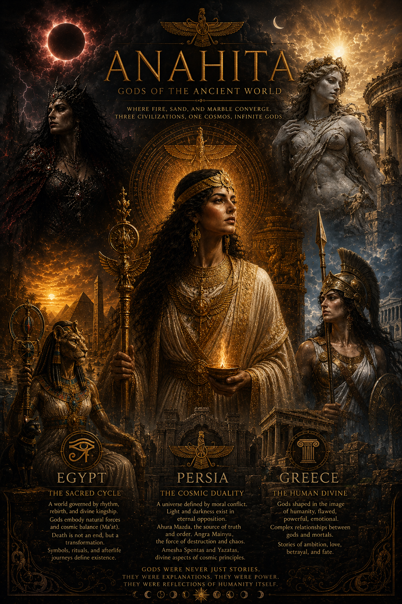

# 🌌 ANAHITA

### *Gods of the Ancient World*

> *Where fire, sand, and marble converge. Three civilizations, one cosmos, infinite gods.*

---

## ✨ Overview

**ANAHITA** is a visual and narrative exploration of ancient mythologies, bringing together the divine worlds of Persia, Egypt, and Greece into a single, immersive experience.

Rather than treating mythology as distant history, this project presents gods as living forces, embodiments of nature, morality, power, and human imagination. Each page invites you into a different cosmology, shaped by its own philosophy, symbols, and sense of the divine.

This is not just a website.
It is a digital archive of gods.

---

## 🏛️ Civilizations Explored

### 🔥 Persia, The Cosmic Duality

A universe defined by moral conflict.
Light and darkness exist in eternal opposition.

* Ahura Mazda, the source of truth and order
* Angra Mainyu, the force of destruction and chaos
* Amesha Spentas and Yazatas, divine aspects of cosmic principles

Persian mythology presents a philosophical battlefield where every choice matters.

---

### ☀️ Egypt, The Sacred Cycle

A world governed by rhythm, rebirth, and divine kingship.

* Gods embody natural forces and cosmic balance (Ma’at)
* Death is not an end, but a transformation
* Symbols, rituals, and afterlife journeys define existence

Egyptian deities are not distant. They are woven into every aspect of life and death.

---

### 🏛️ Greece, The Human Divine

Gods shaped in the image of humanity, flawed, powerful, emotional.

* Complex relationships between gods and mortals
* Stories of ambition, love, betrayal, and fate
* A pantheon that mirrors human nature at its extremes

Greek mythology brings the divine closer, beautiful, chaotic, and deeply relatable.

---

## 🎨 Design Philosophy

ANAHITA is built around atmosphere and immersion.

* Dark, cinematic visuals
* Dynamic lighting and glow effects
* Civilization specific aesthetics
* Subtle animations and transitions
* Focus on storytelling over raw data

Every design choice reflects the identity of the civilization it represents.

---

## 🌠 Vision

This project aims to evolve into:

* A comprehensive mythological atlas
* A visual storytelling platform
* A bridge between history, art, and interactive design

Future expansions may include:

* Additional civilizations such as Norse, Hindu, and Mesopotamian
* Deeper lore sections
* Interactive timelines and maps

---

## 🌓 Final Note

> *Gods were never just stories.*
> They were explanations.
> They were power.
> They were reflections of humanity itself.

**ANAHITA** is an attempt to bring that power back to life.
