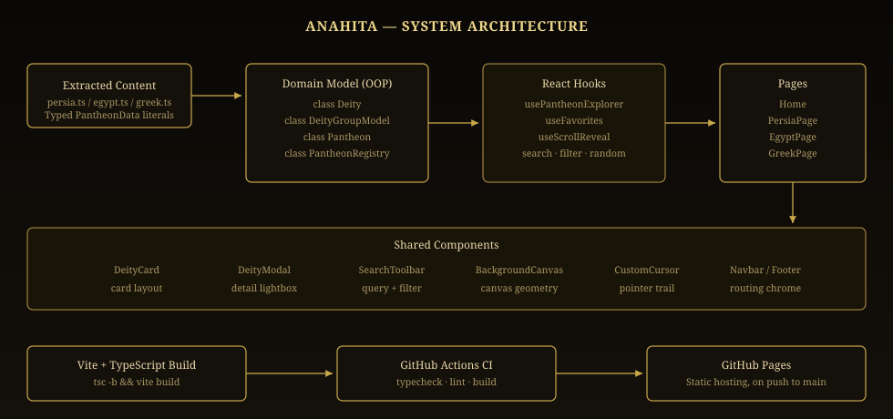
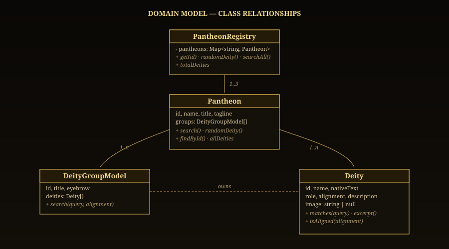
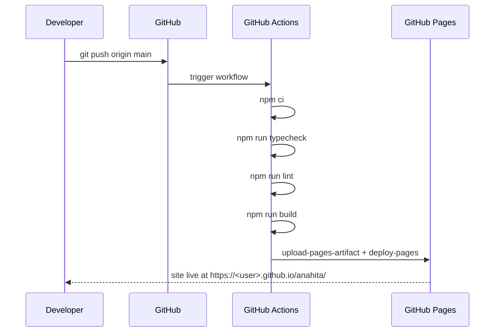

<div align="center">


<br />

[](#deployment)
[](https://react.dev)
[](https://www.typescriptlang.org)
[](https://vitejs.dev)
[](./LICENSE)

**An interactive archive of ancient mythology, rebuilt as a strongly typed, object oriented React application.**

[Live Demo](#deployment) &nbsp;&#183;&nbsp; [Features](#features) &nbsp;&#183;&nbsp; [Architecture](#architecture) &nbsp;&#183;&nbsp; [Getting Started](#getting-started) &nbsp;&#183;&nbsp; [Deployment](#deployment)

</div>

<br />

## Overview

Anahita is a scholarly journey through the divine hierarchies of three ancient civilizations: **Persia**, **Egypt**, and **Greece**. The project began as a static HTML, CSS, and vanilla JavaScript site and has been fully migrated into a **TypeScript, object oriented React** application, ready to build and deploy automatically through **GitHub Actions** to **GitHub Pages**.

The migration preserved every piece of original content (53 deities across 7 thematic pantheon groups) while re-architecting the codebase around typed domain classes, reusable components, and a modern build pipeline. A set of new features was layered on top: search, filtering, favorites, a deity detail modal, a random deity generator, and full keyboard and screen reader support.

<br />

## Features

<table>
<tr>
<td width="33%" valign="top">

### Preserved from the original
- Three fully illustrated pantheons: Persia, Egypt, Greece
- Cinematic hero sections with animated canvas backgrounds
- Custom cursor and scroll reveal animations
- Egypt's rotating Cosmic Cycle wheel
- Persia's Light versus Darkness duality layout
- Greece's generational family tree layout

</td>
<td width="33%" valign="top">

### New in this release
- Live search across every pantheon
- Alignment filters (benevolent, malevolent, neutral)
- Deity detail modal with full biography
- Random Deity discovery button
- Persistent favorites using local storage
- Scroll progress bar and back to top control

</td>
<td width="33%" valign="top">

### Engineering upgrades
- Full TypeScript, strict mode, zero `any`
- Object oriented domain model (see below)
- Client side routing with React Router
- Automated CI: typecheck, lint, build
- One command deploy to GitHub Pages
- Accessible: skip link, ARIA labels, focus states

</td>
</tr>
</table>

<br />

## Architecture

The application separates raw content, domain logic, and presentation into three distinct layers. Content is authored as typed data literals, wrapped by domain classes that expose behavior (search, filtering, random selection), and consumed by React components that know nothing about how the data is stored.

<div align="center">

</div>

### Domain model

The "OOP" in this migration is not cosmetic. Every deity, group, and civilization is a real class instance with encapsulated state and behavior, not a loose object passed around and mutated by whichever component happens to touch it.

<div align="center">

</div>

| Class | Responsibility |
|---|---|
| `Deity` | A single divine being. Exposes `matches()`, `excerpt()`, and `isAligned()` for search and display logic. |
| `DeityGroupModel` | A thematic cluster of deities (for example, "The Titans"). Scopes search to its own members. |
| `Pantheon` | A full civilization. Owns its groups, flattens all deities, and provides lookup and random selection. |
| `PantheonRegistry` | The application wide registry of all three pantheons, used for cross civilization search and the random deity feature. |

<br />

## Project structure

```
anahita/
├── .github/workflows/deploy.yml   CI pipeline: typecheck, lint, build, deploy
├── docs/diagrams/                 SVG diagrams used in this README
├── public/
│   ├── assets/images/             Deity portraits, organized by civilization
│   ├── 404.html                   SPA fallback for GitHub Pages deep links
│   └── robots.txt
├── src/
│   ├── types/mythology.ts         Shared TypeScript contracts
│   ├── models/                    Deity, DeityGroupModel, Pantheon, PantheonRegistry
│   ├── data/                      Typed content: persia.ts, egypt.ts, greek.ts
│   ├── hooks/                     useScrollReveal, useFavorites, usePantheonExplorer
│   ├── components/                DeityCard, DeityModal, SearchToolbar, Navbar, etc.
│   ├── pages/                     Home, PersiaPage, EgyptPage, GreekPage, NotFound
│   ├── styles/                    Ported CSS plus additive enhancement styles
│   ├── App.tsx                    Routing and layout chrome
│   └── main.tsx                   Application entry point
├── index.html
├── vite.config.ts
├── tsconfig.json
└── package.json
```

<br />

## Content

| Civilization | Groups | Deities | Signature layout |
|---|---|---|---|
| Persia | The Two Primal Forces, The Yazatas | 17 | Light versus Darkness duality split |
| Egypt | The Great Pantheon | 12 | Rotating Cosmic Cycle wheel |
| Greece | Chaos, Titans, Olympians, Underworld | 24 | Generational family tree |
| **Total** | **7** | **53** | |

<br />

## Getting started

### Prerequisites

- Node.js 20 or later
- npm 10 or later

### Installation

```bash
git clone https://github.com/<your-username>/anahita.git
cd anahita
npm install
```

### Local development

```bash
npm run dev
```

The app runs at `http://localhost:5173`. Hot module replacement is enabled for every file under `src/`.

### Quality checks

```bash
npm run typecheck   # tsc, strict mode, no emit
npm run lint         # ESLint with the TypeScript and React Hooks rule sets
```

### Production build

```bash
npm run build        # outputs static files to dist/
npm run preview       # serve the production build locally
```

<br />

## Deployment

This project deploys automatically through the workflow at `.github/workflows/deploy.yml`. Every push to `main` triggers the pipeline shown below: dependencies are installed, the codebase is type checked and linted, the production bundle is built with Vite, and the result is published to GitHub Pages.



### One time setup

1. Push this repository to GitHub.
2. In the repository, open **Settings → Pages** and set **Source** to **GitHub Actions**.
3. If the repository is not named `anahita`, update the base path in two places so built asset URLs resolve correctly:
   - `vite.config.ts`, the `BASE_PATH` constant
   - `public/404.html`, the redirect target path
4. Push to `main`. The workflow builds and deploys automatically; no manual `gh-pages` branch or CLI step is required.

<br />

## Accessibility

- A visible skip link jumps straight to the main content for keyboard users.
- All interactive elements (cards, buttons, filters) are reachable by keyboard and expose `aria-label` or `aria-pressed` where relevant.
- The deity detail modal traps focus contextually, closes on `Escape`, and marks itself `role="dialog"` with `aria-modal`.
- Color contrast for text follows the original design system's parchment on near black palette, which meets WCAG AA for body copy.

<br />

## Migration notes

This section documents what changed during the TypeScript and React migration, for anyone comparing against the original static site.

- **Content parity.** All 53 deities, their native language names, roles, and descriptions were extracted programmatically from the original HTML to avoid transcription errors, then wrapped in typed data modules.
- **Content correction.** A recurring authoring artifact in the original copy (line breaks rendered as ". lowercase word" instead of a proper clause separator) was cleaned up during extraction for smoother reading.
- **Visual parity.** The original hand tuned CSS (`main.css`, `pages.css`) was ported without modification, so the cinematic look, canvas backgrounds, and card layouts are pixel equivalent to the legacy site.
- **Behavioral parity.** The custom cursor, scroll reveal animations, Egypt's cosmic cycle wheel positioning, and the home page parallax were all reimplemented as React hooks and effects rather than global `<script>` tags.
- **New capabilities.** Search, alignment filtering, a detail modal, favorites, and a random deity generator did not exist in the original site and were added as part of this migration.

<br />

## Tech stack

<div align="center">


</div>

<br />

## License

Released under the [MIT License](./LICENSE).

<div align="center">
<sub>ANAHITA &nbsp;&#183;&nbsp; THE SACRED ARCHIVE OF DIVINE BEINGS</sub>
</div>
